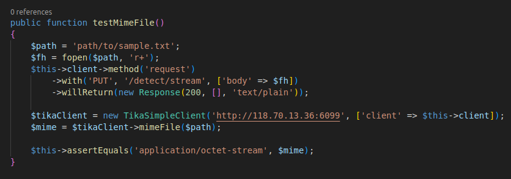

# Unit test Tika

## Test bao gồm 

1. setUp()
    - Tác dụng: Khởi tạo một mock client GuzzleHttp để sử dụng trong các bài kiểm tra.
    - Được gọi trước mỗi bài kiểm tra để chuẩn bị môi trường.
    

1. testVersion()
    - Tác dụng: Kiểm tra phương thức `version()` của `TikaSimpleClient`.
    - Thiết lập phản hồi giả cho yêu cầu phiên bản, trả về chuỗi "1.26.0".
    - Tạo một instance của `TikaSimpleClient` với mock client.
    - Gọi phương thức `version()` và kiểm tra xem phiên bản trả về có khớp với "Apache Tika 2.3.0" hay không.
    

1. testLanguage()
    - Tác dụng: Kiểm tra phương thức `language()` của `TikaSimpleClient`.
    - Thiết lập phản hồi giả cho yêu cầu xác định ngôn ngữ, trả về chuỗi "en".
    - Tạo một instance của `TikaSimpleClient` với mock client.
    - Gọi phương thức `language()` với một chuỗi và kiểm tra xem ngôn ngữ trả về có khớp với "en" hay không.
    

1. testMime()
    - Tác dụng: Kiểm tra phương thức `mime()` của `TikaSimpleClient`.
    - Thiết lập phản hồi giả cho yêu cầu xác định MIME type, trả về chuỗi "text/plain".
    - Tạo một instance của `TikaSimpleClient` với mock client.
    - Gọi phương thức `mime()` với một chuỗi nội dung và kiểm tra xem MIME type trả về có khớp với "text/plain" hay không.
    

1. testRmeta()
    - Tác dụng: Kiểm tra phương thức `rmeta()` của `TikaSimpleClient`.
    - Thiết lập phản hồi giả cho yêu cầu trích xuất siêu dữ liệu, trả về một JSON chứa các thuộc tính "X-TIKA:content" và "X-TIKA:metadata".
    - Tạo một instance của `TikaSimpleClient` với mock client.
    - Gọi phương thức `rmeta()` với một chuỗi nội dung và kiểm tra xem thuộc tính "X-TIKA:content" có phải là một chuỗi hay không.
    

1. testMimeFile()
    - Tác dụng: Kiểm tra phương thức `mimefile()` của `TikaSimpleClient`.
    Thiết lập phản hồi giả cho yêu cầu xác định MIME type từ tệp, trả về chuỗi "text/plain".
    - Tạo một instance của TikaSimpleClient với mock client.
    - Gọi phương thức `mimeFile()` với đường dẫn tệp và kiểm tra xem MIME type trả về có khớp với "application/octet-stream" hay không.
    